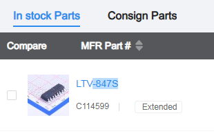

# Parts library

The PCB will be assembled by JCLPCB. The project will require parts number identification to be compatible with LCSC part numbers. 

A library of footprints, schematic symbols and 3D STEP files needs to be created. This README.md explains how to do this. 

To search for part, go to the [JLCPCB Components Search Page](https://jlcpcb.com/parts/componentSearch)

You are expected to create a custom parts library for this project using parts from the JLCPCB compnenets.

## Instructions

- In a terminal make sure you are in the virtual environment, as explained in the project [main README page, Prerequisites](../../README.md#prerequisites)
- cd to "hardware/libs"
- If you have not already done so" "pip install easyeda2kicad"

Now, look up a part of interest. In this example we will use the LTV-847S chip.

- Navigate to: [JLCPCB Components Search Page](https://jlcpcb.com/parts/componentSearch)
- Enter LTV-847S in the search bar.
- Locate the part of interest in the "In Stock Parts" section


- The LCSC part number of the LTV-847S we want is C114599

Run the following command to retrieve the part files:

```
easyeda2kicad --full --lcsc_id=C114599 --output ./myparts
```
This will create the following files in the current directory:
- myparts.kicad_sym (the symbol file)
- myparts.pretty/SMD-16_L20.0-W6.5-P2.54-LS10.2-BL.kicad_mod (the footprint file)
- myparts.3dshapes/SMD-16_L20.0-W6.5-P2.54-LS10.2-BL.step (the 3D file)

Sunsequent executions of the command with different LCSC part numbers will append to the same directory and myparts.kicad_sym file.

## List of Parts

See the file parts.txt. This file contains a list of parts that need to be converted to KiCad format for this project. You need to do this for each part.

**IMPORTANT** 

The first time a part is added to the myparts library, you need to add the library to the KiCad project.

- Open the KiCad Schematic Editor, select Preferences -> Manage Symbol Libraries. In the Project Specific Libraries tab, add the myparts.kicad_sym file. Save.
- Open the KiCad PCB Editor, select Preferences -> Manage Footprint Libraries. In the Project Specific Libraries tab, add the myparts.pretty directory. Save.

After each part is added you need to:

- Open the KiCad Footprint Editor, select Footprint Properties. In the 3D Models tab, delete the existing 3D model (the wrl file) and add the new step file from the myparts.3dshapes directory. You may need to reposition or rotate. Save the footprint.
- Open the KiCad Schematic Editor, select the part in the schematic, right click and select Library Symbol Properties. In the Footprint field, reselect the footprint from the myparts.pretty library. Save.
- Note: The last 2 steps are necessary because of a bug, if you don't do this for a part - the 3D footprint will not be associated with the schematic symbol. 

## Hints

You nay get this error when adding a part:

```
[WARNING] The footprint for this id is already in ./myparts.pretty
[ERROR] Use --overwrite to replace the older footprint library
```
This means a footprint of that type is alread in the library. We need to specify only retrieve the symbol. In this case run:

```
easyeda2kicad --full --lcsc_id=C114599 --output ./myparts --symbol
```