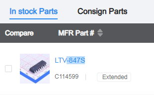

# Parts library

The PCB will be assembled by JCLPCB. The project will require parts number identification to be compatible with LCSC part numbers. 

A library of footprints, schematic symbols and 3D STEP files needs to be created. This README.md explains how to do this. 

To search for part, go to the [JLCPCB Components Search Page](https://jlcpcb.com/parts/componentSearch)

You are expected to create a custom parts library for this project using parts from the JLCPCB compnenets.

## Instructions

- In a terminal make sure you are in the virtual environment, as explained in the project [main README page, Prerequisites](../../README.md#prerequisites)
- cd to "hardware/libs"
- pip install easyeda2kicad
- cd easyeda2kicad/py

Now, look up a part of interest. In this example we will use the LTV-847S chip.

- Navigate to: [JLCPCB Components Search Page](https://jlcpcb.com/parts/componentSearch)
- Enter LTV-847S in the search bar.
- Locate the part of interest in the "In Stock Parts" section


- The LCSC part number of the LTV-847S we want is C114599

Run the following command to retrieve the part files:

```
easyeda2kicad --full --lcsc_id=C114599 --output ..
```
