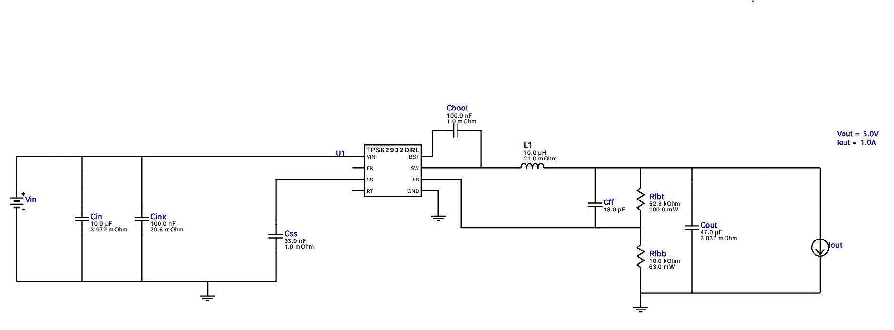

# Power Supply

This directory contains the design files and documentation for the power supply unit used in the Dishy1Pi project. The power supply is responsible for providing the necessary voltage and current to the Dishy1Pi Hat and its connected components.

Reason for this project:
- The Dishy1Pi Hat requires a stable 5V power supply to operate correctly.
- The power supply to the dish1pi is important to ensure reliable operation.
- There are so many choices for power supplies, I wanted to design my own so I am confident the power supply meets the requirements of the Dishy1Pi Hat.
- I need to learn how to design a power supply for a PCB board.

Project Goals:
- Design a power supply PCB that can take an input voltage range of 12-24VDC
- Output a stable 5VDC at up to 1A
- Create a schematic and PCB layout for the power supply that can be manufactured by JLCPCB.
- Get a board manufactureed and assembled by JLCPCB and test it, verify it works.
- Move the design of the power circuit to the dishy1pi project.

KiCad will be used for this project.

Used TI's WEBENCH Power Designer to design the power supply around the TPS62932 buck converter IC. Link: https://webench.ti.com/power-designer/

Out of the myriad of chioces I selected to use the TPS62932DRLR. See the full report, in PDF, created by WEBENCH. Power Supply Report: [power_supply_report.pdf](docs/PowerSupplyDesignReport.pdf)

The WEBENCH report (see PDF) included a BOM. Equivalent components available from LCSC have been identified. LCSC components were identified with properties that match as close as possible to the original BOM.

| Name  | Manufacturer     | Part Number              | Properties                                                                 | Qty | Footprint      | LCSC | Notes |
|-------|------------------|--------------------------|----------------------------------------------------------------------------|-----|----------------|------|-------|
| Cboot | MuRata           | GRM155R71A104KA01D       | Series=X7R; Cap=100.0 nF ESR=1.0 mΩ; VDC=10.0 V; IRMS=0.0 A   | 1   | 0402 3 mm²     |  C71687    |       |
| Cff   | TDK              | CGA1A2C0G1E180J030BA     | Series=C0G/NP0; Cap=18.0 pF; VDC=25.0 V; IRMS=0.0 A              | 1   | 0201 2 mm²     | C599585    |   C0402C180J5GAC7867, 0402    |
| Cin   | Taiyo Yuden      | MSASU32MSB5106KPNA01     | Series=X5R; Cap=10.0 µF; ESR=3.979 mΩ; VDC=50.0 V; IRMS=3.4821 A | 1   | 1210 15 mm²    |  C5677734    |       |
| Cinx  | TDK              | CGA3E2X7R1H104K080AA     | Series=X7R; Cap=100.0 nF; ESR=29.6 mΩ; VDC=50.0 V; IRMS=971.99 mA | 1   | 0603 5 mm²     |  C14663  |  CC0603KRX7R9BB104     |
| Cout  | MuRata           | GRM32ER61C476KE15L       | Series=X5R; Cap=47.0 µF; ESR=3.037 mΩ; VDC=16.0 V; IRMS=4.59346 A | 1   | 1210_280 15 mm²| C5440143   |   CS3225X7R476K160NRL    |
| Css   | MuRata           | GRM155R71A333KA01D       | Series=X7R; Cap=33.0 nF; ESR=1.0 mΩ; VDC=10.0 V; IRMS=0.0 A   | 1   | 0402 3 mm²     |     C307488  |  CL10B333KB8NFNC, 0603     |
| L1    | Bourns           | SRR1208-100ML            | L=10.0 µH; DCR=21.0 mΩ                                                     | 1   | SRR1208 216 mm²|   C2041331  |    STEP@SnapMagic   |
| Rfbb  | Vishay-Dale      | CRCW040210K0FKED         | Series=CRCW..e3; Res=10.0 kΩ; Power=63.0 mW; Tol=1.0%                      | 1   | 0402 3 mm²     |  C71617    |     |
| Rfbt  | Yageo            | RC0603FR-0752K3L         | Res=52.3 kΩ; Power=100.0 mW; Tol=1.0%                                      | 1   | 0603 5 mm²     |   C23198  |    0603WAF5232T5E, NP   |
| U1    | Texas Instruments| TPS62932DRLR             | Switcher IC                                                                | 1   | DRL0008A-MFG 9 mm² | C3032935 |  STEP@ https://www.snapeda.com/   |
| SW1   | C&K              | SS-12F49-G050            | Switch, SPDT                             | 1   | KSC201  | C2876010 |  Added     |
| D1    | BrtLed(Bright LED Elec)       | BL-HZD33-L21-TRB                | White 3.3V LED                                                 | 1   | 1206     | C5264252  |   Added , no CAD, use Generic LED1206   |
| R1    | VO            | SCR0805J560R             | Res=560Ω;                                     | 1   | 0805    | C5264252  |   Added, Generic 0805 resistor    |